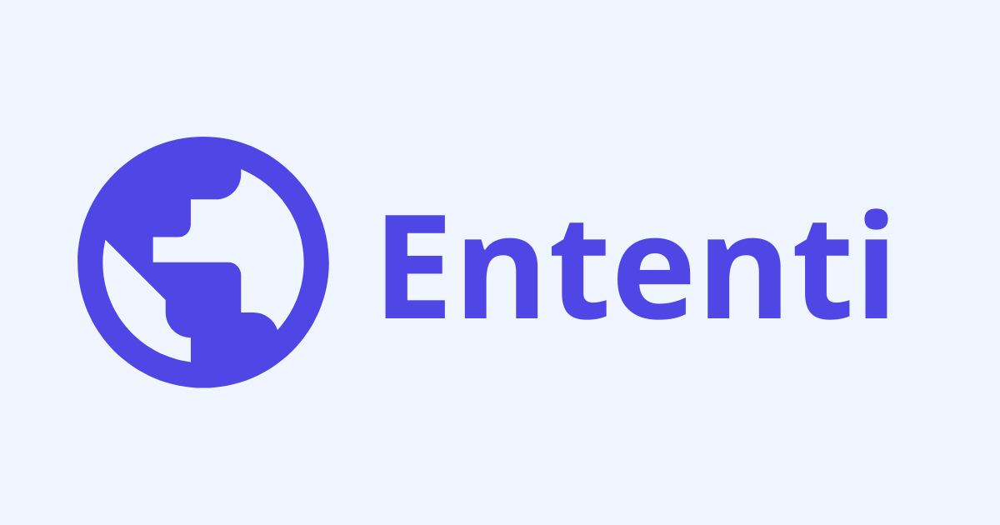

# Ententi: Smart Reading for Language Learners

**Ententi** is an AI-powered reading platform designed specifically for language learners. It transforms online content into personalized, accessible reading materials with translation at your preferred reading level and text-to-speech capabilities for pronunciation practice.



## 🚀 Key Features

### 📖 Simplified Reading Experience
- **Distraction-Free Interface**: Focus solely on the content in a clean, modern UI
- **Variable Reading Levels**: Have text translated to match your current language proficiency
- **Word-Level Interactions**: Tap on any word for instant definitions and translations

### 🎧 Audio Learning Support
- **Text-to-Speech Playback**: Listen to articles in your target language with high-quality natural voices
- **Adjustable Speed Controls**: Slow down playback for better comprehension
- **Synchronized Text Highlighting**: Follow along visually as the text is read

### 📱 Content Management
- **Save Articles From Anywhere**: Save content via URL sharing or direct pasting
- **RSS Feed Integration**: Discover and save content from curated language-learning resources
- **Offline Access**: Read saved content even without an internet connection

### 🧠 AI-Powered Language Tools
- **Reading Age Adaptation**: Automatically adjust content complexity to match your language level
- **Contextual Word Explanations**: Get definitions appropriate to the context
- **Grammar Explanations**: Understand complex sentence structures with AI assistance

## 💻 Tech Stack

- **Frontend**: Next.js 15, React 19, Tailwind CSS 4, Framer Motion
- **Backend**: Supabase (PostgreSQL, Auth, Edge Functions)
- **AI Services**: 
  - OpenAI API for high-quality text-to-speech
  - Gemini API for intelligent content translation
- **Content Processing**: Mozilla Readability for clean article extraction

## 🛠 Getting Started

### Prerequisites
- Node.js 20+
- npm/yarn/pnpm
- Supabase account
- OpenAI API key
- Google AI (Gemini) API key

### Installation

1. Clone the repository:
   ```bash
   git clone https://github.com/yourusername/ententi.git
   cd ententi
   ```

2. Install dependencies:
   ```bash
   npm install
   ```

3. Create a `.env.local` file with the following variables:
   ```
   NEXT_PUBLIC_SUPABASE_URL=your_supabase_url
   NEXT_PUBLIC_SUPABASE_ANON_KEY=your_supabase_anon_key
   OPENAI_API_KEY=your_openai_api_key
   ```

4. Set up your Supabase project:
   - Create a new Supabase project
   - Run the SQL scripts in the `supabase` directory
   - Configure Supabase Edge Functions with your Gemini API key

5. Run the development server:
   ```bash
   npm run dev
   ```

6. Open [http://localhost:3000](http://localhost:3000) in your browser

## 🌟 Use Cases

### For Language Learners
- **Immersive Reading**: Access authentic content that matches your current level
- **Vocabulary Building**: Interact with words in context for better retention
- **Pronunciation Practice**: Listen to native-like pronunciation and practice speaking

### For Language Teachers
- **Customized Materials**: Create level-appropriate reading materials from current events
- **Engaging Homework**: Assign reading that adapts to each student's level
- **Progress Tracking**: Monitor student engagement with reading materials

## 🔒 Privacy & Security

Ententi is designed with privacy in mind. All user data and preferences are securely stored in Supabase, and API keys are handled securely through environment variables.

## 📱 Mobile Experience

The app is fully responsive and works beautifully on mobile devices, allowing language learners to practice on the go.

## 🔜 Roadmap

- Reading comprehension quizzes
- Social learning features
- Spaced repetition for vocabulary
- Progress analytics
- Native mobile apps

## 📄 License

This project is licensed under the MIT License - see the LICENSE file for details.

## 🙏 Acknowledgments

- Mozilla Readability for their incredible content extraction library
- The Supabase team for their robust backend services
- OpenAI and Google for their powerful AI APIs
